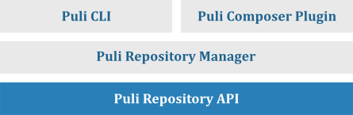

Appendix A: The Puli Components
===============================

Puli consists of six core components:

A summary of each component is given below.

The Repository API
------------------

The `Puli Repository`_ component contains a PHP API for managing *resource
repositories* that map repository paths to arbitrary resources:

.. code-block:: php

    use Puli\Repository\InMemoryRepository;
    use Puli\Repository\Resource\DirectoryResource;

    $repo = new InMemoryRepository();
    $repo->add('/app', new DirectoryResource('/path/to/project/res'));

    echo $repo->get('/app/views/index.html')->getBody();

The Discovery API
-----------------

The `Puli Discovery`_ component contains a PHP API for managing *binding types*
and *bindings* from resources to these types:

.. code-block:: php

    use Puli\Discovery\InMemoryDiscovery;
    use Puli\Repository\Resource\DirectoryResource;

    $discovery = new InMemoryDiscovery($repo);
    $discovery->defineType('doctrine/xml-mapping');
    $discovery->bind('/app/config/doctrine/*.xml', 'doctrine/xml-mapping');

    foreach ($discovery->find('doctrine/xml-mapping') as $binding) {
        foreach ($binding->getResources() as $resource) {
            // do something with $resource...
        }
    }

The Factory API
---------------

The `Puli Factory`_ component contains the :class:`Puli\\Factory\\PuliFactory`
interface that you can use to create :class:`Puli\\Repository\\Api\\ResourceRepository`
and :class:`Puli\\Discovery\\Api\\ResourceDiscovery` instances.

You can either create implementations of this interface yourself or use the one
generated by `the Manager component`_.

The Manager Component
---------------------

The `Puli Manager`_ component manages
:class:`Puli\\Repository\\Api\\ResourceRepository` and
:class:`Puli\\Discovery\\Api\\ResourceDiscovery` instances. You can use the
managers provided by the component to change the contents of the repository and
the discovery:

.. code-block:: php

    use Puli\Manager\ManagerFactory;
    use Puli\Manager\Repository\PathMapping;

    // Start the service container
    $puli = new Puli(getcwd());
    $puli->start();

    $manager = $puli->getRepositoryManager();

    $manager->addPathMapping(new PathMapping('/app', 'res'));

The Manager component stores all configuration in a ``puli.json`` file in
the root directory of the project. This configuration can be used to rebuild the
repository and the discovery at any time:

.. code-block:: php

    $manager->clearRepository();
    $manager->buildRepository();

The Composer Plugin
-------------------

The `Composer Plugin`_ for Puli integrates Composer into the Repository Manager.
With this plugin, the ``puli.json`` files of all installed Composer packages are
loaded automatically. For example, if the Composer package "acme/blog" maps
the Puli path ``/acme/blog`` to its ``res`` directory, you can access these
resources like this:

.. code-block:: php

    // vendor/acme/blog/res/views/index.html
    echo $repo->get('/acme/blog/views/post.html')->getBody();

The Composer Plugin also adds the :class:`Puli\\Factory\\PuliFactory`
implementation generated by the Repository Manager to Composer's autoloader.
The plugin also adds the constant PULI_FACTORY_CLASS to the autoloader, which
holds the name of the generated factory class. This way, you can easily create
factory instances in your code:

.. code-block:: php

    $factoryClass = PULI_FACTORY_CLASS;
    $factory = new $factoryClass();

The Command Line Interface
--------------------------

The `Puli CLI`_ is a command line interface to the Repository Manager. The
command ``puli path`` can be used to display path mappings and add new ones:

.. code-block:: text

    $ puli path map /app res

You can instantiate the repository modified by the CLI through the
:class:`Puli\\Factory\\PuliFactory` generated by the Repository Manager:

.. code-block:: php

    $factoryClass = PULI_FACTORY_CLASS;
    $factory = new $factoryClass();
    $repo = $factory->createRepository();

    // res/views/index.html
    echo $repo->get('/app/views/index.html')->getBody();

.. _Composer: https://getcomposer.org
.. _Puli Repository: https://github.com/puli/repository
.. _Puli Discovery: https://github.com/puli/discovery
.. _Puli Factory: https://github.com/puli/factory
.. _Puli Manager: https://github.com/puli/manager
.. _Puli CLI: https://github.com/puli/cli
.. _Composer Plugin: https://github.com/puli/composer-plugin
