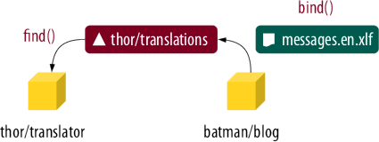

The Discovery Component
=======================

The `Discovery Component`_ connects Composer packages that **consume**
|resources| with Composer packages that **provide** resources.

The Problem
-----------

At the moment, you need to write a lot of boilerplate code if you use different
packages that use each other's files. Suppose you install the following two
packages in your application:

* The package ``thor/translator``, which uses ``*.yml`` files to translate text
  to some language.
* The package ``batman/blog``, which contains the files ``blog.en.yml`` and
  ``blog.fr.yml`` with translations for the strings in the package.

As user of these packages, you have to register the ``*.yml`` files with the
``Translator`` instance of the ``thor/translator`` package:

.. code-block:: php

    $translator = new Translator(array(
        __DIR__.'/../vendor/batman/blog/res/trans/blog.en.yml',
        __DIR__.'/../vendor/batman/blog/res/trans/blog.fr.yml',
    ));

If you're lucky, your framework does this job for you. However, offloading this
task to framework developers doesn't scale, since for any combination of
package and framework, *someone* needs to write and maintain such integration
code. That's a lot of duplicated work.

How It Works
------------

Puli's Discovery Component solves this problem by decentralizing the resource
registration process. Composer packages are divided into *resource consumers*
and *resource providers*.

Resource consumers, like our translator, register a name for the resources they
want to use. This name is called a *binding type*. In this example, the
developer of the translator defines the binding type "thor/translations" and
publishes that type in their documentation.

Other packages (the resource providers) assign their translation files to this
binding type. This is called a *binding*. In the end, the translator fetches all
translation files for its binding type from a
:class:`Puli\\Discovery\\Api\\ResourceDiscovery` instance.

By communicating only through Puli's Discovery Component and a common binding
type, consumers and providers are completely decoupled from each other. As user
of these packages, you only need to pass the
:class:`Puli\\Discovery\\Api\\ResourceDiscovery` instance to the translator:

.. code-block:: php

    $translator = new Translator($discovery);

Puli takes care of everything else.

Getting Started
---------------

Read :doc:`getting-started` to learn how to install and use the Discovery
Component in your project.

.. _Discovery Component: https://github.com/puli/discovery

.. |resources| replace:: :ref:`resources <glossary-resource>`
