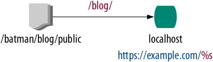

The URL Generator Component
===========================

The `URL Generator Component`_ generates URLs for the |resources| in your Puli
repository.

The Problem
-----------

When writing HTML, CSS or JavaScript code, you frequently need to refer to
other resources of the web server. A simple example is a HTML ```` tag:

.. code-block:: html

    

Hard-coded URLs, however, have a few issues:

.. topic:: Changing the Deployment Target

    If you decide to host all images on another server -- like a Content
    Delivery Network (CDN) -- you need to manually add the domain name of the
    CDN to all image paths.

.. topic:: Changing the Version

    If you version files by appending ``?v1`` query parameters, you need to
    manually update the versions whenever you publish a new release.

.. topic:: Creating Reusable Packages

    If your code is part of a Composer package, you force the users of the
    package to publish your resources at exactly the location that you have
    hardcoded in your code. In the above example, for instance, the user can't
    choose to move the file to ``/blog/images/logo.png`` instead.

How It Works
------------

Puli solves this problem by automating the URL generation of your resources.
Instead of hardcoding the URLs, you pass the |Puli path| of the resource to the
URL Generator Component:

.. code-block:: html+jinja

    

You can also use relative paths to shorten your code:

.. code-block:: html+jinja

    

The end user of your package finally configures how the URLs should be
generated:



At first, the end user registers at least one *web server*. A web server in
Puli has a name and a *URL format*. The URL format tells Puli how the generated
URLs should look like. In this example we use "localhost" as the name and
``https://example.com/%s`` as the URL format of our web server.

Next, Puli resources are mapped to the web server. Such resources are called
*public resources*. In this example we map the Puli path ``/batman/blog/public``
to the ``/blog/`` directory in the document root of the web server.

The generated URL looks like this:

.. code-block:: html

    

Puli finally automates the deployment of your public resources to the Web
Server. By telling Puli where your web server is located and how the public
resources should be moved there (symlink, copy, rsync, ...), you can install
them with a single CLI command:

.. code-block:: text

    $ php puli.phar publish --install
    Installing /batman/blog/public into public_html/blog via symlink...

Getting Started
---------------

Read :doc:`getting-started` to learn how to install and use public resources
in your project.

.. _URL Generator Component: https://github.com/puli/url-generator

.. |resources| replace:: :ref:`resources <glossary-resource>`
.. |Puli path| replace:: :ref:`Puli path <glossary-puli-path>`
